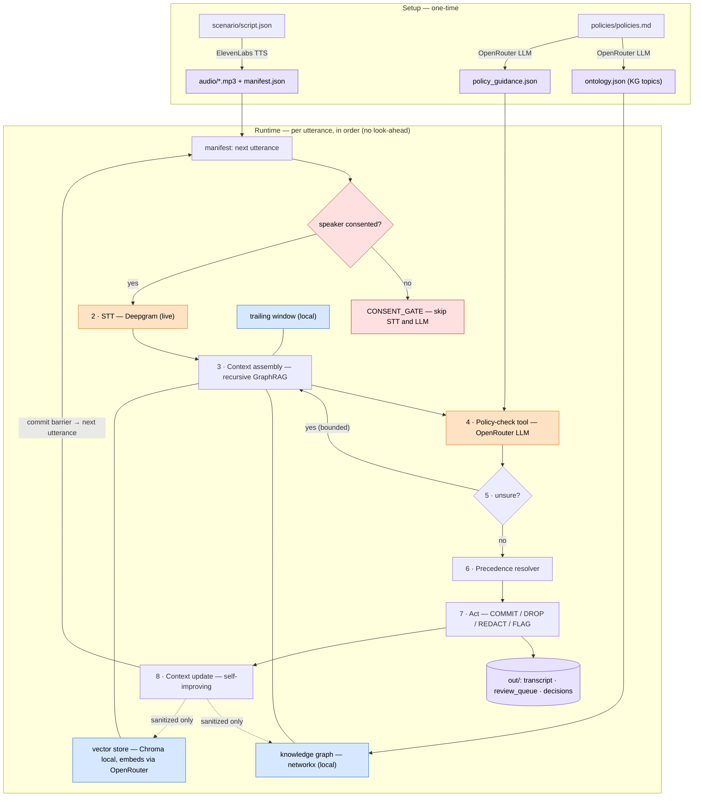
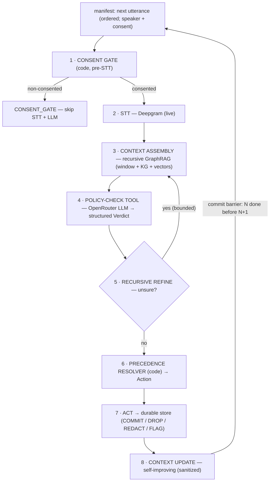
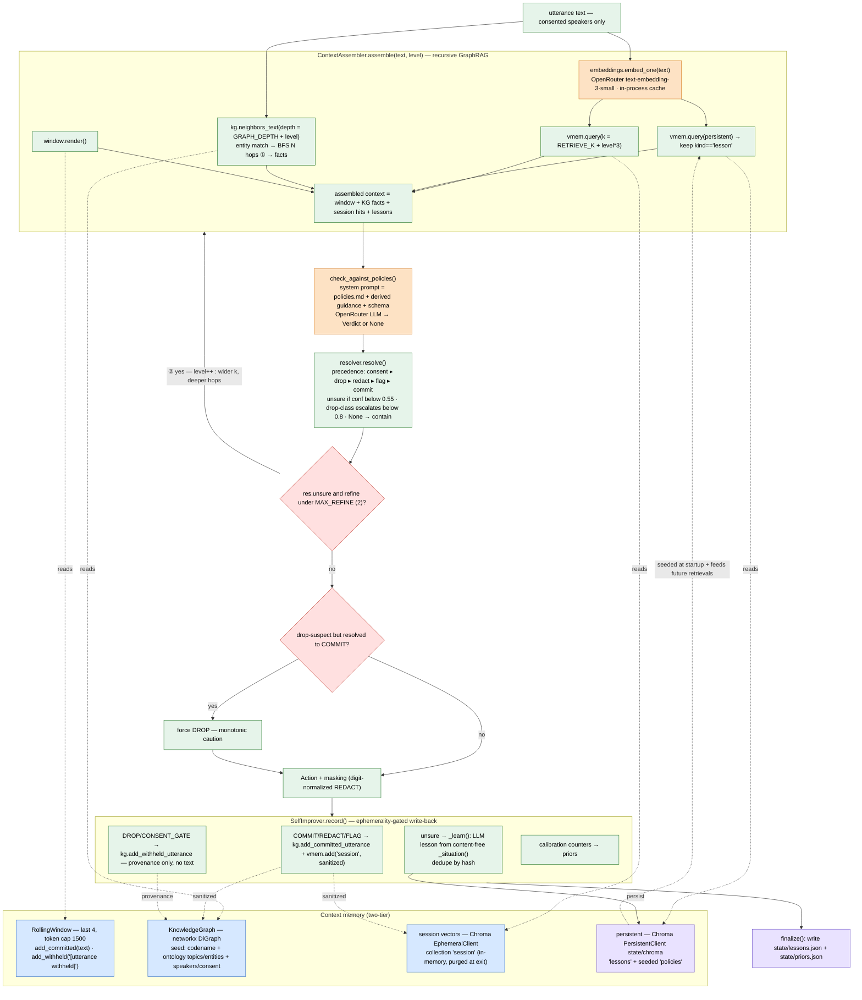

# Real-Time Meeting-Governance Agent for Regulated Industry

A working MVP of a **real-time governance layer for high-stakes meetings**. As people
speak, the agent decides — utterance by utterance, *before anything is durably
written* — what is allowed to be recorded: keep it, drop it without a trace, redact
a number, flag it for legal, or decline it entirely because the speaker never
consented.

The pipeline is real end to end: **real speech-to-text (Deepgram)** → online,
bounded-window reasoning → a **policy-check tool running real LLM inference
(OpenRouter)** over plain-English policies → one action from a closed set, applied
to a durable store before the next utterance commits. Nothing is stubbed.

On top of the required slice it adds an **ephemerality-aware, recursive GraphRAG +
knowledge-graph + self-improving context system** so governance decisions are made
with the richest possible context *without ever retaining content the policies
forbid*.

---

## Table of contents
- [Quick start](#quick-start)
- [Reproducing a live transcription run](#reproducing-a-live-transcription-run)
- [End-to-end architecture](#end-to-end-architecture)
- [Architecture: the window → infer → act loop](#architecture-the-window--infer--act-loop)
- [The agent / tool boundary](#the-agent--tool-boundary)
- [Context engineering: recursive GraphRAG + KG + self-improvement](#context-engineering-recursive-graphrag--knowledge-graph--self-improvement)
- [Rolling window: choice & justification](#rolling-window-choice--justification)
- [Ephemerality: how a DROP leaves no trace](#ephemerality-how-a-drop-leaves-no-trace)
- [The action set & precedence](#the-action-set--precedence)
- [When the agent is unsure](#when-the-agent-is-unsure)
- [The scenario & expected decisions](#the-scenario--expected-decisions)
- [Where AI tools were used](#where-ai-tools-were-used)
- [Implementation: what the codebase actually uses](#implementation-what-the-codebase-actually-uses)
- [What I'd harden for production](#what-id-harden-for-production)
- [Project layout](#project-layout)

---

## Quick start

Prerequisites: macOS/Linux, [`uv`](https://docs.astral.sh/uv/), `ffmpeg`, and three API
keys.

```bash
cp .env.example .env      # then fill in the three keys:
#   OPENROUTER_API_KEY   (all generative LLM calls)
#   DEEPGRAM_API_KEY     (real STT)
#   ELEVENLABS_API_KEY   (one-time audio generation)

uv sync --extra dev                            # install deps (py3.12)
uv run python scripts/generate_audio.py        # ONE-TIME: synthesize the meeting audio + manifest
uv run python run.py --live                    # transcribe live + govern; prints the decision log
uv run python verify.py                        # assert ephemerality + correctness on the outputs
```

`OPENROUTER_MODEL` defaults to a strong reasoning model and is swappable in `.env`
(e.g. `anthropic/claude-3.7-sonnet`, `openai/gpt-4o`, `google/gemini-2.5-pro`) with no
code changes.

Run the offline logic tests (no keys needed) any time:

```bash
uv run pytest -q                 # resolver, window, consent, KG — pure logic
uv run pytest -m live -q         # full pipeline matrix (needs keys + generated audio)
```

## Reproducing a live transcription run

The **graded run transcribes live** — `run.py --live` calls Deepgram at runtime; it
does **not** load a precomputed transcript. Steps:

1. `uv run python scripts/generate_audio.py` — ElevenLabs synthesizes one short `.mp3`
   per utterance into `audio/` and writes `scenario/manifest.json` (the ordered list
   with per-speaker **consent** labels). This is a one-time setup step; you can delete
   `audio/` and regenerate at any time.
2. `uv run python run.py --live` — for each utterance, in order: apply the consent
   gate, transcribe the clip with Deepgram, assemble context, call the policy tool,
   resolve the action, and write the result. The per-utterance decision log streams to
   stdout; artifacts land in `out/`.
3. `uv run python verify.py` — greps everything the system *produced* (`out/`, `state/`)
   to prove the sensitive content is absent and the trap content is present.

A `--cache` flag reuses an on-disk STT cache for fast iteration; it is **bypassed by
`--live`** so the graded run always transcribes fresh.

---

## End-to-end architecture

The system has a one-time **setup** path (generate the audio + derive the config
from the policies) and a **runtime** path (the live governance loop). Everything in
the runtime path is real — real STT, real LLM inference — and every external
dependency is labeled below.



**Components → modules → dependency:**

| Stage | Module | External dependency |
|---|---|---|
| Audio generation (setup) | `scripts/generate_audio.py` | ElevenLabs |
| Topic / guidance derivation (setup) | `governance/topics.py`, `governance/guidance.py` | OpenRouter |
| 1. Consent gate | `governance/consent.py` | — (code) |
| 2. STT | `governance/stt.py` | Deepgram |
| 3. Context assembly | `governance/context.py`, `kg.py`, `vectorstore.py`, `embeddings.py` | OpenRouter (embeddings); Chroma + networkx (local) |
| 4. Policy-check tool | `governance/policy_tool.py`, `llm.py` | OpenRouter |
| 5. Recursive refine | `governance/agent.py` | OpenRouter |
| 6. Precedence resolver | `governance/resolver.py` | — (code) |
| 7. Act / stores | `governance/store.py` | — (local files) |
| 8. Self-improvement | `governance/selfimprove.py` | OpenRouter (lesson generation); Chroma (local) |
| Orchestration / commit barrier | `governance/agent.py` | — (code) |

---

## Architecture: the window → infer → act loop

Each utterance flows through a strictly sequential pipeline. There is **no
look-ahead** — when deciding utterance *N*, the agent can only see utterances `< N`.



This is deliberately a **workflow, not a model-driven agentic loop**: consent,
precedence, and ephemerality are enforced in plain, testable code, so the model can
never override them.

## The agent / tool boundary

- **The agent** (`src/governance/agent.py`) is the orchestration loop. It owns control
  flow, the consent gate, context assembly, the recursive-refine loop, the precedence
  resolver, action execution, the rolling window, KG/vector updates, and the commit
  barrier.
- **The tool** (`src/governance/policy_tool.py`) is `check_against_policies(utterance,
  context) → Verdict`: a single real LLM call that reasons over the plain-English
  policies and returns a **structured verdict of evidence** (which policies matched,
  what to redact, a confidence). It deliberately does **not** emit the final action —
  the agent's `resolver.py` derives that, so even a self-contradictory model output is
  resolved safely.

The model reasons over **meaning**. There are no keyword lists or regexes in the
decision path — and adding a regex digit-matcher was *deliberately rejected* because
it would redact the office phone number and fail the Beat-9 trap.

## Context engineering: recursive GraphRAG + knowledge graph + self-improvement

A flat trailing window can't tell that "Project Atlas" was established as the deal
codename twelve turns ago, and it risks letting dropped content linger. So the context
the policy tool reasons over is assembled by an **ephemerality-aware GraphRAG layer**
(`context.py`, `kg.py`, `vectorstore.py`, `embeddings.py`, `selfimprove.py`):

- **Knowledge graph** (`networkx`) — seeded from a **config-controlled ontology**
  (`scenario/ontology.json`: topics + entities) plus the codename (known from Policy 2,
  **not** learned from dropped speech) and per-speaker consent (from the manifest).
  Topics are **not hardcoded** — they live in the ontology file and can be regenerated
  from the policies with `uv run python -m governance.topics` (an LLM derivation step),
  so the taxonomy stays in sync when the policies change. The graph grows during the run
  with **sanitized** facts only.
- **Recursive retrieval** — embed the utterance (**OpenRouter embeddings**, e.g.
  `openai/text-embedding-3-small`; the resulting vectors are stored **locally** in
  Chroma), pull top-k from the in-session vector store + persistent lessons, then
  **expand across the KG to N hops** (`GRAPH_DEPTH`). This is what surfaces the
  codename-vs-movie distinction and long-range entity context the window misses.
- **Recursive self-refinement** — when the verdict is low-confidence (or the model
  refuses / returns junk), the agent re-assembles at a higher `level` (more hops, larger
  k, pull lessons) and re-queries, bounded by `MAX_REFINE`.
- **Self-improvement** — after each decision the in-session KG/vector grow with
  sanitized facts; on a borderline/unsure decision the agent **reflects via the LLM
  and generates** a durable, content-free guideline (from non-sensitive signals only —
  which policy, what action, the confidence — never the utterance text), which is
  stored in `state/` and retrieved in future sessions. Lessons are *generated, not a
  hardcoded table*; calibration counters persist too.

### Context-engineering architecture (end to end)

For each utterance the **context assembler** fans in four sources, the **policy
tool** consumes the assembled context, and the **self-improving indexer** writes
sanitized signal back — a closed loop. Recursion happens in two places (marked
①②).



- **① KG traversal** expands entities mentioned in the utterance to N hops, so a
  reference is grounded even when its setup was far outside the 4-utterance window
  (e.g. the codename established many turns earlier).
- **② Recursive refine** re-assembles at a higher `level` (more hops, larger k,
  pull lessons) and re-queries when the verdict is low-confidence — bounded, and
  it can only confirm a no-copy-topic suspicion, never relax it.
- **Write-back is the self-improvement loop**: confident, sanitized facts grow the
  in-session graph; borderline decisions generate a durable, content-free lesson
  that is retrieved in later runs — the system gets better at its own gray zones.

**Two-tier memory keeps this honest:**

| Tier | Lives | Holds |
|---|---|---|
| In-session working memory | in-process, **purged at run end** | sanitized entity facts + verdict provenance for *this* meeting |
| Persistent store (`state/`) | on disk, across sessions | **non-sensitive only**: policy text, abstracted lessons, calibration counts |

DROP / non-consent content **never enters either tier** — only a content-free
provenance marker ("a governed removal occurred at u6 under policy 1"). No transcript
content, no codename usage, and no numbers are ever persisted across sessions.

You can A/B the lift the context layer provides:

```bash
uv run python run.py --live                  # full GraphRAG context
uv run python run.py --live --simple-window  # baseline: trailing window only
```

## Rolling window: choice & justification

**`WINDOW_SIZE = 4`** trailing committed-or-placeholder utterances, additionally
token-capped (~1500 tokens). Trailing only; no look-ahead.

Why 4: spoken references in meetings rarely reach back more than 3–4 turns, so 4 covers
pronoun/topic carryover and immediate disambiguation while keeping each LLM call small
(latency + cost) and **bounding how long any retained content sits in memory**. The
window holds only committed/sanitized text; after a DROP/CONSENT_GATE the entry is a
**content-free placeholder** (`[utterance withheld]`) that carries no topic — so dropped
content can never linger in the buffer or leak into a later prompt. Disambiguation that
needs context older than 4 turns is handled by **GraphRAG retrieval over the KG**, not
by enlarging the window — so the window stays small *and* context stays rich. The
constant is a single grep-able value you can sweep.

## Ephemerality: how a DROP leaves no trace

Ephemerality is the product's core promise, so we enumerate every place a copy could
leak and how each is handled:

| Leak site | Handling |
|---|---|
| In-memory trailing window | Raw text evicted on DROP/CONSENT_GATE *before* the next commit; replaced by a content-free placeholder. (unit-tested) |
| KG / vector store / lessons | DROP/non-consent content is **never indexed** — only a content-free provenance node. Persistent store holds non-sensitive abstractions only. |
| LLM provider (OpenRouter) egress | The one unavoidable egress for *classified* content — to decide a thing is droppable we must send it once. **Non-consented speech is never sent at all** (the gate is pre-STT/pre-LLM). We document this rather than overclaim. |
| STT (Deepgram) | Non-consented clips are **never transcribed**. For DROP, transcript references are released after the decision and no STT intermediates are persisted. |
| Logs / decision audit | Record action, policy ids, confidence, generic reason — **never raw text, the cleartext redaction value, or the model's verbatim reasoning** for DROP/REDACT. |
| stdout decision log | Prints `content withheld` for DROP/CONSENT_GATE; previews only safe committed text otherwise. |
| Durable transcript | Only COMMIT (full) / REDACT (masked) / FLAG (full + marker). DROP & CONSENT_GATE write nothing. |
| Review-queue back-door | Flags/escalations store an id + a *masked* preview, never raw droppable text. |
| **Source audio files** | The clip for a DROP beat still contains the words. We scope ephemerality to everything the system **produces**; the input audio is the simulated live source. (In production we'd securely delete a clip on DROP — see hardening.) |

The honest one-line claim: **no copy of DROP'd or non-consented content persists in any
artifact this system produces, and non-consented speech is never transcribed or sent to
the LLM.** `verify.py` proves the produced-artifact half by grepping `out/` and `state/`.

## The action set & precedence

`COMMIT` · `DROP` · `REDACT(value)` · `FLAG_FOR_REVIEW` · `CONSENT_GATE`.

When an utterance implicates more than one policy, the resolver applies a fixed ladder
(`resolver.py`):

```
CONSENT_GATE  >  DROP  >  REDACT  >  FLAG_FOR_REVIEW  >  COMMIT
```

e.g. compensation talk that also contains a card number is **dropped** (no copy),
because you cannot keep any part of compensation talk. The consent gate sits above
everything and runs before the LLM.

## When the agent is unsure

The safe default for *this* product is containment: a false COMMIT of sensitive content
is far costlier than a false drop/flag. So when confidence falls below
`CONFIDENCE_THRESHOLD` — or the model refuses / returns unparseable output — the agent:

1. **recursively refines** (retrieve more context, re-query) up to `MAX_REFINE` times;
2. if still unsure and the uncertainty could be a drop-class concern → **contain**
   (treat as DROP, no copy);
3. otherwise **keep but escalate** to the human review queue.

It never commits sensitive content in the clear on uncertainty. Beat 10 ("the board
will discuss *comp philosophy* at the offsite") is the designed showcase: a meta-
reference to compensation with no actual figures — genuinely ambiguous, so it lands as
low-confidence and is contained/escalated rather than confidently kept or dropped.

## The scenario & expected decisions

A ~3-minute M&A diligence call: **Northwind Capital** (buyer) on **Cendara Robotics**
(target), codename **Project Atlas**. Four speakers; **Tomás Herrera (outside counsel)
did not consent**. Speakers are labeled via the manifest (per the brief, diarization is
out of scope).

| # | Utterance (beat) | Expected | Why |
|---|---|---|---|
| u01 | Roll call (1) | COMMIT | ordinary |
| u02 | Agenda (2) | COMMIT | ordinary |
| u03 | "where we are on **Project Atlas**" (3) | **DROP** | codename tied to the deal (P2) |
| u04 | Revenue / concentration / churn (4) | COMMIT | financials, not account numbers/comp |
| u05 | Bank account `8847-220193-04` (5) | **REDACT** | financial identifier (P4) |
| u06 | Card `4012-8888-3320-7741` (5) | **REDACT** | financial identifier (P4) |
| u07 | Retention pay / salary figures (6) | **DROP** | compensation, no copy (P1) |
| u08 | Tomás's legal read (7) | **CONSENT_GATE** | non-consented — never transcribed (P5) |
| u09 | "shipped a known safety defect, missed the filing" (8) | **FLAG_FOR_REVIEW** | legal exposure, keep+flag (P3) |
| u10 | "*Project Atlas: The Everest Ascent*" documentary (9) | **COMMIT** | trap — not the deal codename |
| u11 | Office **phone** number (9) | **COMMIT** | trap — phone ≠ financial identifier (not redacted) |
| u12 | "comp philosophy at the offsite" (10) | **UNSURE → contain/escalate** | meta-reference, no figures |
| u13 | Close (11) | COMMIT | ordinary |

(The two REDACT utterances are split out of beat 5; `test_pipeline_matrix.py` asserts
this matrix against the real pipeline.)


## Implementation: 

Everything below is what the code really does — exact libraries, SDK calls,
models, constants, and data flow — so a reviewer can map every claim to a line.

### Runtime dependencies (from `pyproject.toml`)

| Package | Constraint | Used for | Where |
|---|---|---|---|
| `openai` | `>=1.40` | OpenRouter client (chat completions **and** embeddings — OpenAI-compatible) | `llm.py`, `embeddings.py` |
| `deepgram-sdk` | `>=3.7` (installed **v7**) | real speech-to-text | `stt.py` |
| `elevenlabs` | `>=1.8` | scenario TTS | `scripts/generate_audio.py` |
| `chromadb` | `>=0.5` | local vector store (in-memory + on-disk) | `vectorstore.py` |
| `networkx` | `>=3.3` | in-process knowledge graph (`DiGraph`) | `kg.py` |
| `pydantic` | `>=2.8` | structured verdict schema + validation | `models.py`, `*.py` |
| `python-dotenv` | `>=1.0` | load `.env` | `config.py` |
| `tiktoken` | `>=0.7` | token-bounded window cap (`cl100k_base`) | `window.py` |
| `pytest` (dev) | `>=8.0` | tests | `tests/` |

> OpenRouter, with vectors stored locally.

### External services and the exact calls made

| Service | SDK / client | Call actually used | Key params |
|---|---|---|---|
| **OpenRouter** (LLM) | `openai.OpenAI(base_url="https://openrouter.ai/api/v1")` | `client.chat.completions.create(...)` | `response_format={"type":"json_object"}`, `temperature=0` |
| **OpenRouter** (embeddings) | same client | `client.embeddings.create(model=…, input=[…])` | model `openai/text-embedding-3-small` (1536-dim) |
| **Deepgram** (STT) | `deepgram.DeepgramClient(api_key=…)` (v7) | `client.listen.v1.media.transcribe_file(request=<bytes>, …)` | `model="nova-2"`, `smart_format=True`, `punctuate=True`, `language="en"` |
| **ElevenLabs** (TTS) | `elevenlabs.client.ElevenLabs(api_key=…)` | `client.text_to_speech.convert(...)`, `client.voices.get_all()` | `model_id="eleven_turbo_v2_5"`, `output_format="mp3_44100_128"` |
| **Chroma** (local) | `chromadb.EphemeralClient()` + `chromadb.PersistentClient(path="state/chroma")` | `get_or_create_collection(...)`, `add(...)`, `query(...)` | cosine space; embeddings passed explicitly |

Structured output is **not** model-specific: `llm.structured()` requests JSON, parses
it, validates against a Pydantic model, and does **one repair retry**; a refusal /
unparseable response returns `None`, which the resolver treats as *unsure → contain*.

### Models & defaults (all overridable in `.env`)

| Role | Env var | Default |
|---|---|---|
| Governance LLM | `OPENROUTER_MODEL` | `openai/gpt-4o` |
| Embeddings | `EMBED_MODEL` | `openai/text-embedding-3-small` |
| STT | `DEEPGRAM_MODEL` | `nova-2` |
| TTS | `ELEVENLABS_MODEL` | `eleven_turbo_v2_5` |

### Tunable constants (`config.py`)

| Constant | Default | Meaning |
|---|---|---|
| `WINDOW_SIZE` | `4` | trailing utterances kept in the window |
| `WINDOW_TOKEN_CAP` | `1500` | hard token cap on the window |
| `CONFIDENCE_THRESHOLD` | `0.55` | below → unsure → contain/escalate |
| `HIGH_CONFIDENCE` | `0.8` | drop-class actions below this are also escalated for review |
| `MAX_REFINE` | `2` | bounded recursive-refine iterations |
| `RETRIEVE_K` | `5` | vector top-k (grows with refine level) |
| `GRAPH_DEPTH` | `2` | KG traversal hops (grows with refine level) |
| `DEAL_CODENAME` | `"Project Atlas"` | codename seeded a priori from Policy 2 |

### Module-by-module (what each file actually does)

| File | Responsibility | Key symbols |
|---|---|---|
| `config.py` | env + constants + ontology loader | `load_ontology()`, `require()`, the constants above |
| `models.py` | domain + verdict schema | `Action` enum, `Utterance`, `PolicyMatch`, `Redaction`, `Verdict`, `Decision` |
| `consent.py` | hard consent gate (pre-STT) | `is_gated(utt)` |
| `stt.py` | Deepgram v7 STT (+ optional sha256 cache) | `STT.transcribe(path)` |
| `llm.py` | OpenRouter chat client + structured output | `LLM.structured(system, user, schema)` |
| `embeddings.py` | OpenRouter embeddings + in-process cache | `embed()`, `embed_one()` |
| `vectorstore.py` | two-tier Chroma memory | `VectorMemory.add/query/seed_policies` |
| `kg.py` | networkx KG, seeded from config ontology | `seed()`, `add_committed_utterance()`, `add_withheld_utterance()`, `neighbors_text()` |
| `context.py` | recursive GraphRAG assembler | `ContextAssembler.assemble(text, level)` |
| `window.py` | trailing window + content-free eviction | `RollingWindow.add_committed/add_withheld/render` |
| `policy_tool.py` | dynamic system prompt + policy inference | `build_system_prompt()`, `check_against_policies()` |
| `resolver.py` | precedence ladder + unsure/escalation | `resolve(verdict)` → `Resolution` |
| `selfimprove.py` | LLM-generated lessons + calibration | `SelfImprover.record/finalize`, `Lesson`, `_learn()` |
| `topics.py` | derive KG topics from policies | `derive_topics()` → `ontology.json` |
| `guidance.py` | derive reasoning guidance from policies | `derive_guidance()` → `policy_guidance.json` |
| `agent.py` | orchestration loop + commit barrier | `Orchestrator.run/_process/_commit`, `_mask()` (digit-normalized) |
| `store.py` | durable, scrubbed output stores | `persist(decision)`, `reset()` |
| `run.py` | CLI | flags `--live`, `--cache`, `--simple-window`, `--verbose` |
| `verify.py` | end-to-end ephemerality/correctness checks | greps `out/`+`state/` |

### The structured verdict (what the LLM returns, validated by Pydantic)

```python
PolicyMatch(policy_id: int[1..4], matched: bool, rationale: str, span: str | None)
Redaction(value: str, reason: str)
Verdict(policy_matches: list[PolicyMatch], redactions: list[Redaction],
        confidence: float[0..1], overall_reasoning: str)   # NO model-emitted action
```

The orchestrator's `resolver.resolve()` derives the `Action` — the model never
emits it directly.

### Data artifacts

| Kind | Path | Created by | Notes |
|---|---|---|---|
| Spoken script | `scenario/script.json` | authored | the 11 beats |
| Audio + manifest | `audio/*.mp3`, `scenario/manifest.json` | `generate_audio.py` | manifest = speaker+consent ground truth |
| Policies | `policies/policies.md` | authored | source for prompt + topics + guidance |
| KG ontology | `scenario/ontology.json` | `governance.topics` (LLM) | topics + entities |
| Reasoning guidance | `scenario/policy_guidance.json` | `governance.guidance` (LLM) | per-policy guidance |
| Governed transcript | `out/transcript.jsonl` | runtime | COMMIT/REDACT/FLAG only |
| Review queue | `out/review_queue.jsonl` | runtime | flags + escalations (content-free for contained) |
| Audit log | `out/decisions.jsonl` | runtime | action/policy/confidence; never raw text |
| Persistent memory | `state/lessons.json`, `state/priors.json`, `state/chroma/` | runtime | non-sensitive only, cross-session |
| STT iteration cache | `.stt_cache/` | `--cache` | dev only; bypassed by `--live` |

### Test cases

| File | Needs keys? | Checks |
|---|---|---|
| `tests/test_resolver.py` | no | precedence ladder + unsure path |
| `tests/test_window.py` | no | window eviction + ephemerality |
| `tests/test_consent.py` | no | per-speaker consent gate |
| `tests/test_kg.py` | no | KG seeding from config + content-free provenance |
| `tests/test_integration_offline.py` | no | full orchestration via `tests/offline_sim.py` stand-ins (`FakeLLM`/`FakeSTT`) |
| `tests/test_pipeline_matrix.py` | **yes** (`-m live`) | beat→action matrix + no-trace, against real APIs |

## What I'd harden for production

- **Streaming STT** (Deepgram live) for true real-time instead of per-clip prerecorded.
- **Speaker diarization** to remove the manifest-as-ground-truth assumption; today
  consent enforcement is exactly as correct as the speaker labels.
- **Secure deletion of source clips on DROP**, closing the last leak site (input audio).
- **Second-hand reference scrubbing** — a consented speaker paraphrasing non-consented
  speech is not handled in this MVP.
- **Cryptographic provenance / tamper-evident audit** for the legal record, and
  **encryption-at-rest** for `state/`.
- **A KG consistency-reflection pass** and an **eval harness** over many generated
  scenarios to calibrate the confidence threshold.
- **Latency & cost budgets** per call; cache the stable policy prefix.

## Project layout

```
scenario/script.json        the spoken script (11 beats, fixed names/numbers)
scenario/ontology.json      config-controlled KG topics + entities (regenerable)
scenario/policy_guidance.json  per-policy reasoning guidance derived from the policies
scripts/generate_audio.py   ElevenLabs TTS → audio/ + scenario/manifest.json
policies/policies.md        the 5 plain-English policies (source for prompt + topics + guidance)
src/governance/
  agent.py        orchestration loop (gate → context → infer → refine → resolve → act → update)
  policy_tool.py  check_against_policies(): real OpenRouter inference → structured Verdict
  resolver.py     precedence ladder + unsure path (Verdict → Action)
  models.py       Pydantic schema (Verdict, PolicyMatch, Redaction, Decision, Action)
  consent.py      the hard consent gate (pre-STT/pre-LLM)
  window.py       bounded trailing window + content-free eviction
  context.py      recursive GraphRAG context assembler
  kg.py           networkx knowledge graph (seeded from config ontology, sanitized growth)
  vectorstore.py  two-tier Chroma memory (ephemeral session + persistent lessons; vectors local)
  embeddings.py   embeddings via OpenRouter (vectors stored locally)
  topics.py       derive the KG topic taxonomy from the policies (python -m governance.topics)
  guidance.py     derive per-policy reasoning guidance from the policies (python -m governance.guidance)
  selfimprove.py  sanitized self-improvement + LLM-generated lessons + calibration
  stt.py          Deepgram STT (live; non-consented never transcribed)
  llm.py          OpenRouter client (structured JSON + validate + repair)
  store.py        durable, scrubbed output stores
  config.py       env + tunables (WINDOW_SIZE, thresholds, paths)
run.py            CLI entrypoint
verify.py         end-to-end ephemerality + correctness checks
tests/            offline logic tests + the live pipeline matrix
```
